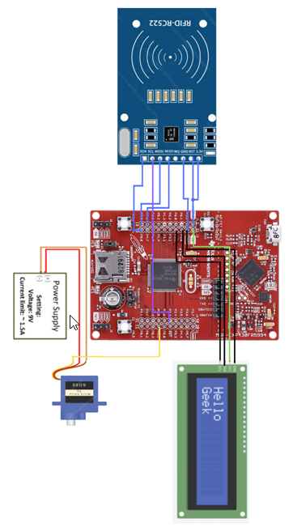

# Embedded System Vault Design (MSP430)

Conceptual embedded system design for a secure vault using RFID authentication, LCD user feedback, and servo-based actuation.

## Overview
This project presents the design of an embedded system built around the MSP430FR5994 microcontroller. The system integrates multiple communication protocols and peripherals to implement a secure access control mechanism.

## System Diagram

Block diagram showing integration of RFID authentication, LCD interface (I2C), and servo control (PWM) on the MSP430 platform.

## System Design

The system consists of three main subsystems:

- **Authentication:** RFID-RC522 module (SPI communication)
- **User Interface:** I2C LCD display for feedback
- **Actuation:** Servo motor controlled via PWM for locking/unlocking

When a valid RFID tag is detected, the system displays user information and actuates the servo to unlock the vault. Invalid tags result in access denial and no actuation.

## Architecture Highlights
- SPI communication for RFID module  
- I2C communication for LCD interface  
- PWM control for servo actuation  
- Embedded control logic implemented on MSP430  

## My Contributions
- Designed system architecture and component integration  
- Defined communication interfaces (SPI, I2C, PWM)  
- Developed control logic for authentication and actuation  
- Created system-level block diagram and design documentation  

## Documentation
[View Full Report](docs/embedded-system-report.pdf)

Includes detailed system architecture, communication protocols, and embedded system design considerations.

## Note
This project focuses on system design and architecture rather than full hardware implementation.
